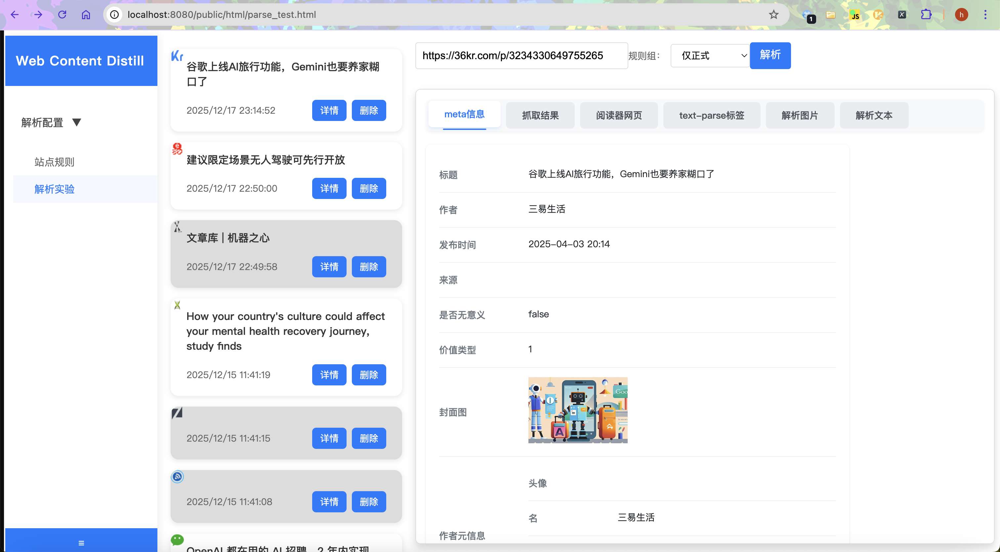
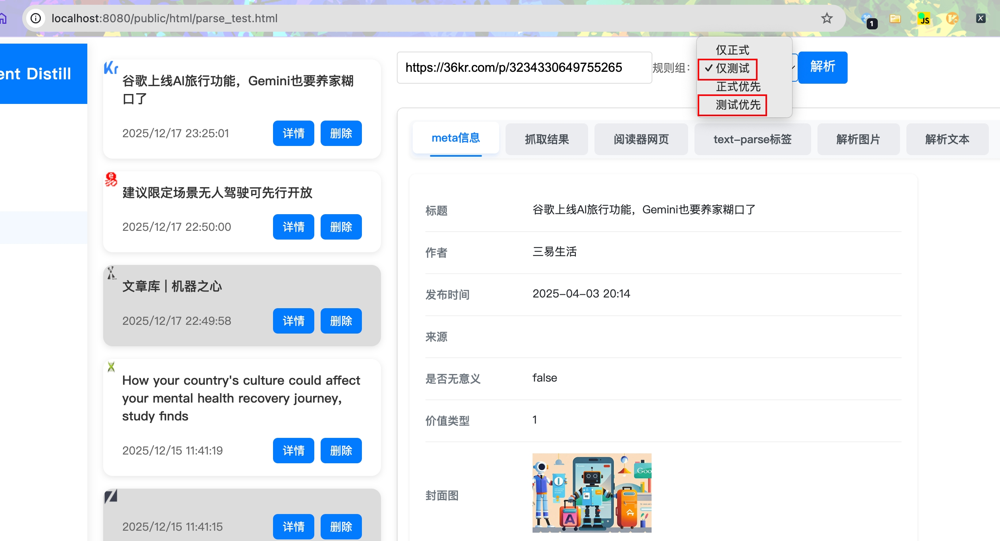
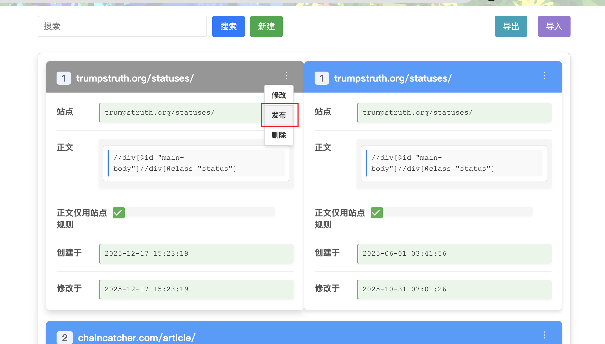

# WCD (Web Content Distillation) 项目文档

## 项目简介

WCD (Web Content Distillation) 是一个高性能的网页内容解析与去噪系统，专注于从HTML文档中智能提取有价值的内容，并过滤掉广告、导航、评论等无关内容。本项目基于Go语言开发，提供了完整的网页内容处理流程，包括HTML切分、内容标注和去噪处理等核心功能。

## 项目结构

WCD项目采用清晰的分层架构设计，各模块职责明确：

```
wcd/
├── biz/                # 业务层
│   ├── handler/        # HTTP请求处理器
│   ├── model/          # 业务数据模型
│   └── router/         # 路由配置与注册
├── conf/               # 配置文件
├── consts/             # 系统常量与规则定义
├── dal/                # 数据访问层
├── data/               # 数据文件
├── dummy_apps/         # 示例应用
├── http/               # HTTP客户端实现
├── model/              # 数据模型定义
├── script/             # 脚本文件
├── service/            # 核心服务层
├── static/             # 静态资源
├── tools/              # 工具函数库
└── utils/              # 通用工具函数
```

### 核心模块说明

1. **service/wcd/**: 核心处理逻辑
   - `WcdParseService`: 主服务入口，协调各处理步骤
   - `SegmentService`: HTML文档切分服务
   - `DistillService`: 内容去噪服务

2. **tools/**: 工具函数集合
   - `Parser`: 内容解析器，提取标题、作者等元信息
   - `Cleaner`: 内容清洗器，去除噪声
   - `Splitter`: 文本切分器，将内容分割为句子
   - `Formatter`: 格式化器，处理HTML结构
   - `Extractor`: 元信息提取器（标题、作者、发布时间等）

3. **consts/**: 系统常量与规则
   - 内容标签规则
   - 噪声识别规则
   - 无价值内容判断规则
   - 正则表达式规则

4. **biz/**: 业务逻辑层
   - 处理外部HTTP请求
   - 实现业务路由
   - 定义业务数据模型

5. **dal/**: 数据访问层
   - MongoDB数据库操作
   - 站点规则存储

## 核心功能

WCD系统提供了丰富的网页内容处理功能：

- **网页内容提取**: 从复杂HTML中智能提取核心文本内容
- **元信息提取**: 获取标题、作者、发布时间、来源等关键信息
- **图片提取**: 保留文章中的相关图片
- **噪声过滤**: 过滤广告、导航栏、评论等无关内容
- **内容价值判断**: 判断页面是否包含有价值信息
- **站点规则管理**: 为不同网站配置特定的解析规则
- **解析实验**: 测试和验证解析效果

## 核心处理流程

WCD系统的处理流程主要包含以下几个关键步骤：

1. **HTML切分 (Segmentation)**
   - 解析HTML文档结构
   - 提取文章元信息（标题、作者、发布时间等）
   - 初步清洗HTML内容
   - 将内容分割为句子单元

2. **内容标注 (Labeling)**
   - 将切分后的句子发送给标注模型
   - 接收模型返回的标注结果，识别内容类型（正文、广告、导航等）

3. **内容去噪 (Distillation)**
   - 根据标注结果进行精确去噪
   - 重新构建干净的HTML结构
   - 提取纯文本内容
   - 判断内容是否有价值

## 快速开始

### 环境要求

- Go 1.24.4+（仅本地开发需要）
- MongoDB 8.0+（用于存储站点规则）
- Docker（仅Docker部署需要）

### 方式一：本地开发启动

#### 1. 配置环境

```sh
# 修改配置文件中的数据库连接信息，默认使用dev环境
# 配置文件路径：conf/config_dev.yaml
```

#### 2. 安装依赖

```sh
go mod tidy
```

#### 3. 构建项目

```sh
go build -o app
```

#### 4. 启动主服务

```sh
./app
```

主服务将在 `http://localhost:8080` 启动。

#### 5. 启动抓取服务

为解析网页内容，您需要启动抓取服务。本项目提供了一个简单的Python脚本作为示例，您可以根据实际需求进行修改。

```sh
# 进入dummy_apps目录
cd dummy_apps
# 安装依赖
pip install -r requirements.txt
# 启动抓取服务
python server_crawler.py
```

抓取服务是WCD系统的重要组成部分，负责网页内容的抓取和预处理。启动后，抓取服务将在 `http://localhost:18100` 运行，为主服务提供抓取支持。

### 方式二：Docker快速启动

#### 1. 启动服务

```sh
cd wcd
docker-compose up -d
```

Docker Compose会自动拉取所需镜像并启动服务，包括MongoDB数据库和WCD应用。

#### 2. 验证服务

服务启动后，您可以通过以下方式验证服务是否正常运行：

```sh
# 检查服务状态
curl http://localhost:8080/ping
```

预期返回：`{"message":"pong"}`

### 站点规则导入

无论您选择哪种启动方式，首次使用时都需要导入站点规则：

1. 打开管理系统：`http://localhost:8080/public/html/rule.html`


2. 点击页面上的「导入」按钮
3. 选择项目根目录下的 `data/rules.json` 文件
4. 等待导入完成，系统将显示导入成功的提示

### 快速体验

导入规则后，您可以通过以下方式快速体验WCD的功能：

#### 方法一：使用解析测试页面

1. 打开解析测试页面：`http://localhost:8080/public/html/parse_test.html`



2. 在「输入URL」框中输入任意新闻或博客文章的URL，例如：
   ```
   https://36kr.com/p/3234330649755265
   ```
3. 点击「解析」按钮
4. 等待片刻，页面将显示解析结果，包括：
   - 原始HTML内容
   - 解析后的标题、作者、发布时间等元信息
   - 去噪后的干净内容
   - 纯文本内容

#### 方法二：使用API接口

您可以使用curl或Postman等工具直接调用API接口：

```sh
# 使用curl调用解析接口
curl -X POST -H "Content-Type: application/json" -d '{"url":"https://36kr.com/p/3234330649755265"}' http://localhost:8080/base-parse
```

API将返回JSON格式的解析结果，包含去噪后的内容和元信息。

## API文档

### 主要API接口

#### 内容解析接口

1. **解析网页内容**
   - API路径：`POST /base-parse`
   - 功能：解析网页内容，返回去噪后的结果。如果未提供html，将会自动抓取目标网页内容。此接口除规则去噪之外，会调用解析模型来对内容进行标注，以精确实现网页去噪。目前解析模型并没有开源，所以代码中调用的解析模型是mock的。
   - 参数：
     - `url`: 目标网页URL
     - `html`: 可选，直接提供HTML内容

2. **按规则解析文本内容**
   - API路径：`POST /wcd/segment`
   - 功能：利用站点规则，对文本内容进行解析和去噪。
   - 参数：
     - `url`: 目标网页URL
     - `html`: 直接提供HTML内容

#### 健康检查接口

1. **服务状态检查**
   - API路径：`GET /ping`
   - 功能：检查服务是否正常运行

## 管理系统

WCD提供了一个简单直观的管理系统，用于配置站点规则和进行解析实验：

- **访问地址**: http://localhost:8080/public/html/rule.html

### 管理系统功能

1. **站点规则配置**: 为不同网站配置特定的解析规则
2. **解析实验**: 测试和验证解析效果
3. **规则管理**: 查看、编辑和删除站点规则
4. **规则导入导出**: 批量导入和导出站点规则

## 规则管理

### 规则类型

1. **标签规则 (LABEL_RULES)**: 根据解析模型（目前未开源）的标签，识别不同类型的内容
   - `LABEL_NOISE`: 噪声内容
   - `LABEL_REFERENCE`: 引用内容
   - `LABEL_TITLE`: 标题内容
   - `LABEL_PUB_TIME`: 发布时间
   - `LABEL_AUTHOR`: 作者信息
   - `LABEL_SOURCE`: 内容来源

2. **噪声规则 (TINY_NOISE_RULES)**: 识别和过滤广告、推广等无关内容

3. **无价值内容规则**: 识别404页面、内容已删除页面等

### 站点规则配置

站点规则主要配置项：
- `bodies`: 正文内容选择器
- `noises`: 噪声内容选择器
- `title`: 标题选择器
- `pub_time`: 发布时间选择器
- `author`: 作者选择器
- `reserved_nodes`: 保留节点
- `no_semantic_denoise`: 是否禁用语义去噪
- `need_browser_crawl`: 下载网页前是否需要浏览器渲染
- `body_use_rule_only`: 是否仅使用规则选择正文内容，而用解析模型的标签

### 规则管理最佳实践

1. **更新噪声规则**
   - 编辑 `consts/tiny_noise_rule.go` 添加新的噪声模式
   - 每条噪声规则应包含：匹配文本、最大允许长度、匹配规则描述

2. **添加站点特定规则**
   - **推荐流程**：
     1. 使用管理系统或API创建测试规则
     2. 配置规则参数（正文选择器、噪声选择器等）
     3. 在测试环境验证规则效果
     
     4. 确认效果后发布到正式环境
     

3. **规则版本管理**
   - 利用"从正式规则创建测试规则"功能维护版本历史
   - 定期导出规则备份
   - 发布前在测试环境全面验证

## 监控与日志

系统使用Hertz框架的日志组件进行日志记录，主要日志包括：
- 请求处理日志
- 错误日志
- 性能指标日志

## 常见问题

1. **解析失败**
   - 检查HTML格式是否规范
   - 确认目标网站是否有特殊的反爬机制
   - 尝试更新或添加特定站点规则

2. **内容提取不完整**
   - 检查站点规则配置是否正确
   - 尝试调整正文选择器
   - 考虑启用浏览器渲染模式

3. **服务启动失败**
   - 检查MongoDB是否正常运行
   - 检查配置文件中的数据库连接信息是否正确
   - 查看日志文件获取详细错误信息

## 维护与更新

### 规则平台接口

WCD系统提供了完整的规则管理平台接口，用于维护和更新站点规则。所有接口都通过HTTP REST API提供，主要功能如下：

#### 规则查询接口
- 获取站点规则列表
- 获取站点规则详情

#### 规则管理接口
- 创建测试规则
- 从正式规则创建测试规则
- 更新测试规则
- 发布测试规则
- 删除规则

#### 规则导入导出接口
- 导出所有站点规则
- 导入站点规则

### 版本更新

系统版本信息定义在 `consts/version.go` 文件中，更新版本时请同时更新该文件。

## 技术栈

- **语言**: Go 1.24.4+
- **Web框架**: Hertz
- **数据库**: MongoDB
- **HTTP客户端**: Go标准库 + 自定义实现
- **HTML解析**: Go标准库 `net/html` + 自定义工具

## 相关项目

- [beevik/etree](https://github.com/beevik/etree): 用于操作XML文档的Go库。使用体验上接近Python的lxml库，可以用相似的方法操作dom节点。wcd项目中主要使用此库来操作dom节点。
优缺点：
   - 使用上已经相当接近python的lxml.etree，但不支持xpath1.0的函数，如contains等。也不支持复杂的查询。
- [antchfx/xmlquery](https://github.com/antchfx/xmlquery): 用于查询XML文档的Go库。wcd项目中主要使用此库来实现利用xpath查询dom节点。但遗憾的是此库不能操作dom节点等。
   - 优点: 
      - API 接口简单，易于使用。
   - 缺点：
      - 节点文本（只能使用InnerText，但只能获取整个树节点的文本）、tail文本，读取不方便。
      - **不能操作dom**。如新增节点、操作属性等。

- [ChrisTrenkamp/xsel](https://github.com/ChrisTrenkamp/xsel): 用于查询XML文档的Go库。
   - 优点: 
      - XPath 支持: 近乎完整的 XPath 1.0 支持，但不支持 id 函数。
      - DOM 操作: 提供对 DOM 的读取和查询，支持绑定变量和自定义函数。
   - 缺点：
      - 不支持dom操作

wcd项目中曾经考虑过基于etree的Document和xsel的interface来实现一个兼有二者优点的dom库，即同时支持完整dom操作和xpath 1.0查询，但受限于精力未实现。最终选择组合使用etree和xmlquery来实现wcd项目。

## 贡献

欢迎提交Issue和Pull Request来帮助改进WCD系统。

## 许可证

[MIT License]()
